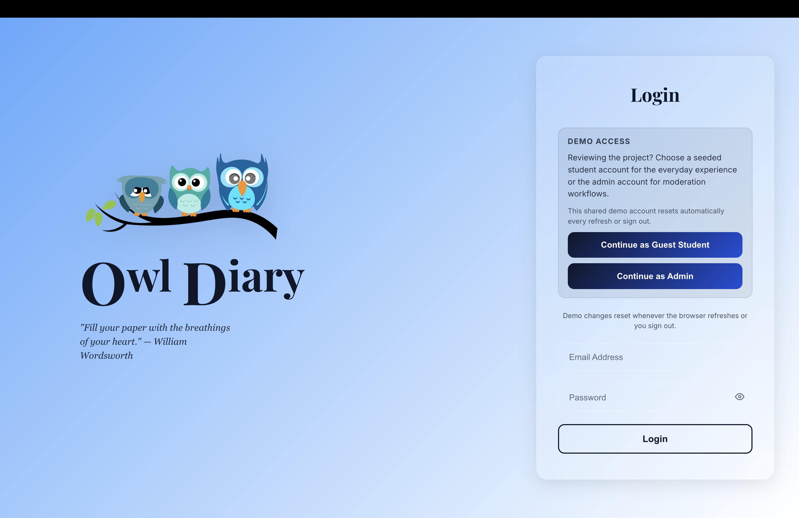
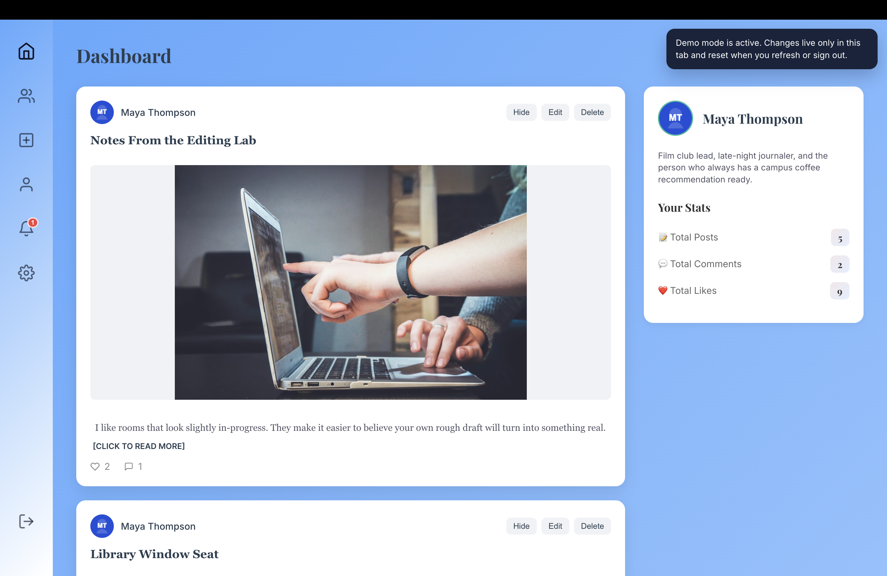
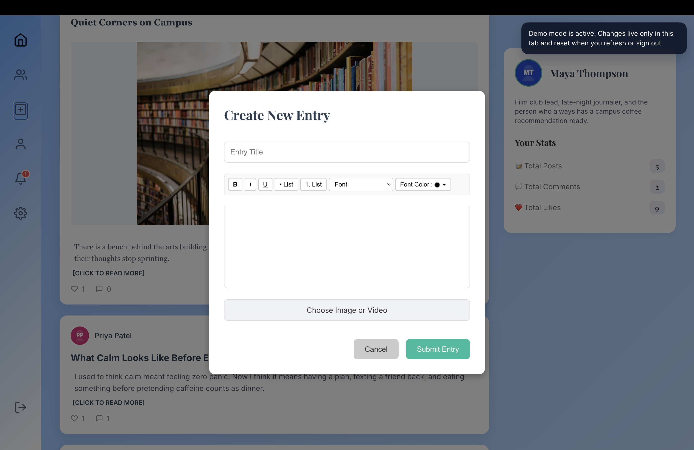
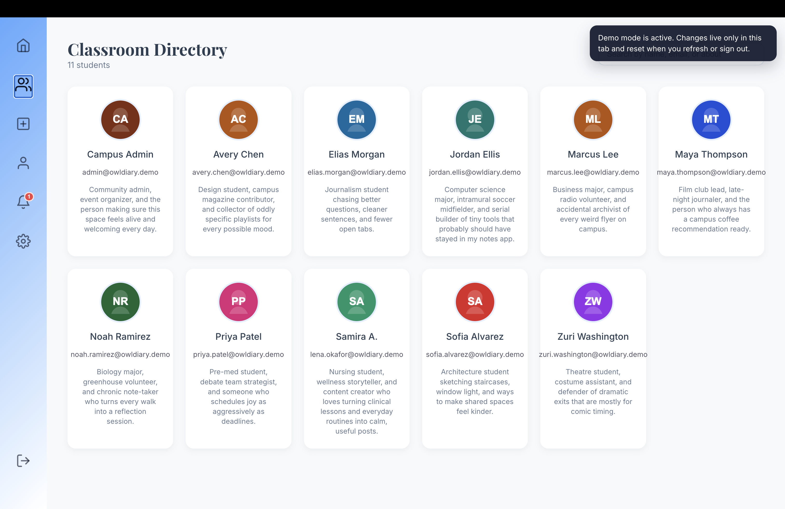
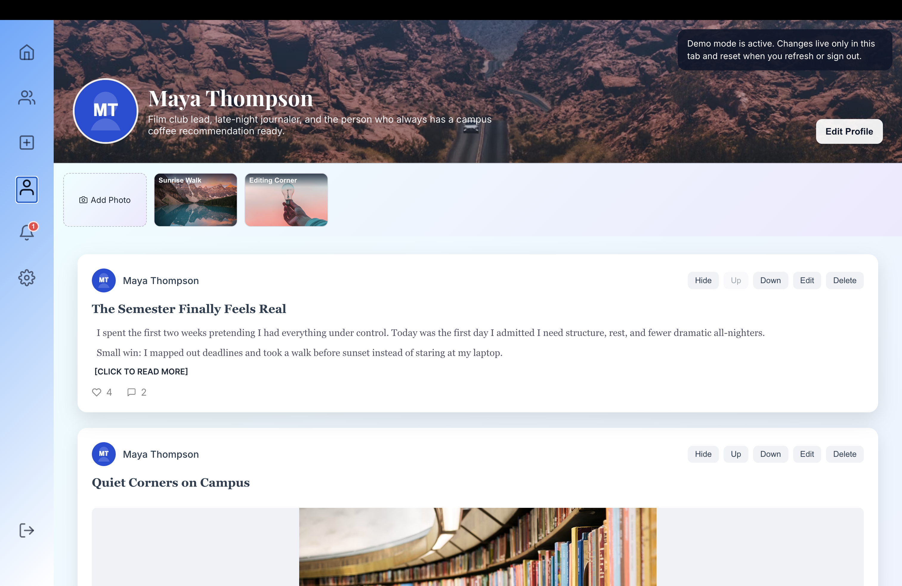
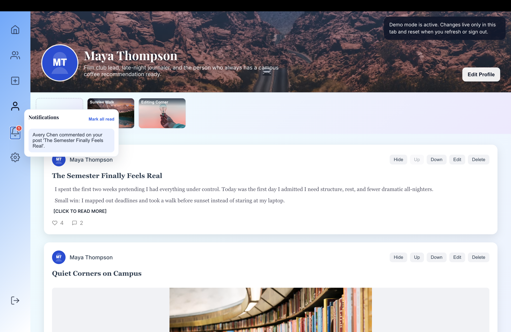
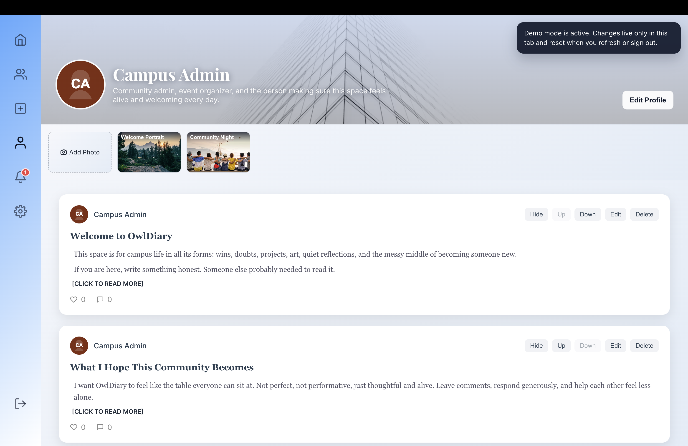
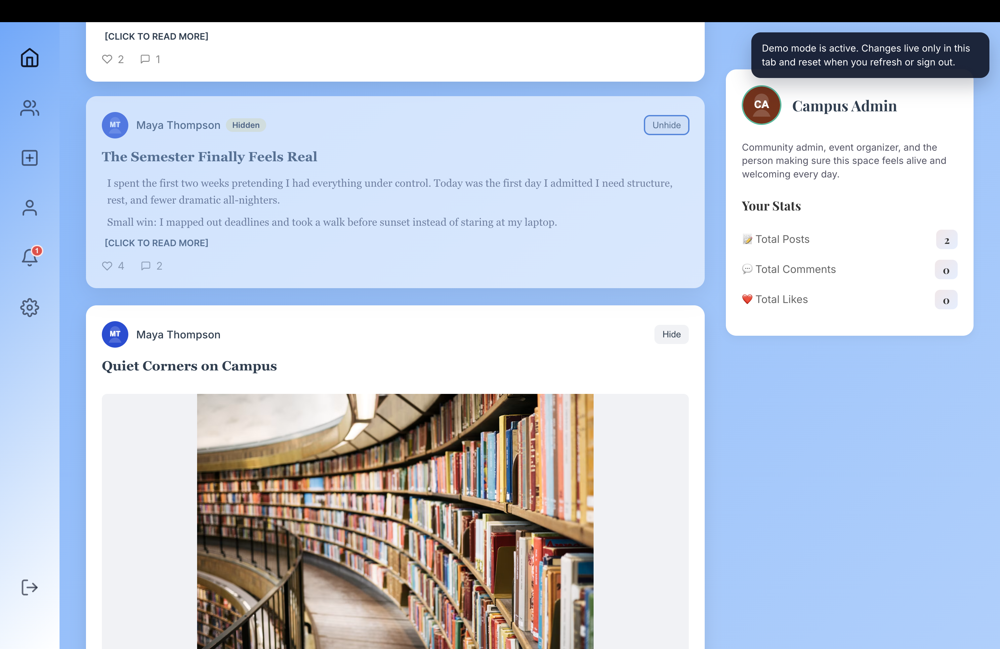
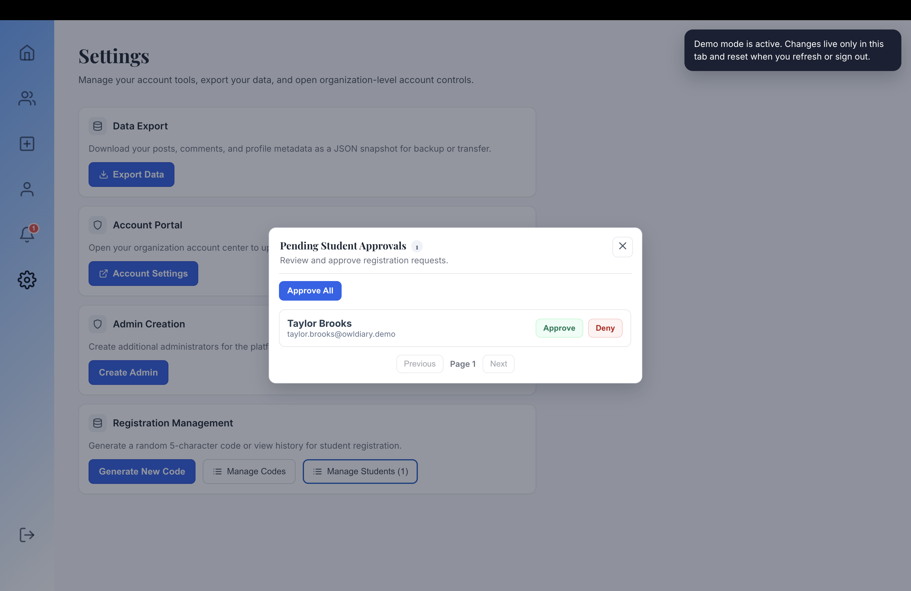

# OwlDiary

## Screenshots

### Demo Entry

| Login and role selection |
| --- |
|  |

### Guest Student Flow

| Dashboard feed | Classroom directory |
| --- | --- |
|  |  |

| Create post modal | Student profile |
| --- | --- |
|  |  |

| Notifications |
| --- |
|  |

### Professor Admin Flow

| Hide inappropriate posts | Professor/admin profile |
| --- | --- |
|  |  |

| Approval and registration management |
| --- |
|  |

## What This App Is

OwlDiary is a university-centered social journaling app. Students can write posts, react to each other, leave comments, browse profiles, and personalize their presence in the app instead of being locked into a single static profile template.

The real classroom codebase is hosted on the SCSU school server and cannot be shared publicly. This repository is a separate public demo adaptation I created so recruiters, instructors, and visitors can still experience the product, interface, and major workflows without exposing the private school-hosted version.

For this demo version, the project includes a seeded recruiter mode so reviewers can explore the product without depending on a live database. The app resets when the browser refreshes or the user signs out, which keeps the demo safe to share while still showing the full interaction model.

Live demo: [https://owl-diary.vercel.app/login](https://owl-diary.vercel.app/login)

## How Reviewers Can Explore It

Use `Continue as Guest Student` on the login page to experience the standard student flow:

- browse the journal feed
- open full post pages
- create, edit, hide, and delete your own posts
- like and comment on other users' posts
- browse the classroom directory
- open profile pages with galleries and custom styling
- view notifications from the sidebar dropdown
- export your own data from settings

Use `Continue as Admin` to test the professor-style class management flow:

- review pending students who signed up with a registration code
- approve or deny who gets admitted to the class space
- generate and manage registration codes used during sign-up
- hide or unhide inappropriate student posts
- participate in the shared community feed as the course moderator

## Demo Roles

- `Guest Student`: the everyday product experience for recruiters, instructors, and classmates
- `Admin`: a professor-style moderator role that manages class access, registration codes, and inappropriate content

The demo ships with seeded users, seeded posts, seeded comments, seeded notifications, and generated non-real-person avatars. The seeded content is intentionally rich enough to show real navigation and interaction flow without exposing real user data.

## Core Product Areas

### 1. Writing and social interaction

Students can publish text, image, or video-style entries, then interact through likes and comments. The experience is closer to a lightweight campus social journal than a plain notes tool.

### 2. Personalized profiles

Each profile supports a profile background, avatar, bio, font preferences, accent color, and gallery items. That gives each user page a distinct visual identity.

### 3. Recruiter-safe seeded demo mode

The frontend can intercept its own `/api/*` calls and serve seeded in-memory data. This lets the app run as a realistic showcase without requiring a live backend to stay up.

### 4. Professor moderation tools

The admin flow is framed as a professor role. Professors can approve students into the class after signup, manage the registration codes students use to join, hide posts that are inappropriate for the course space, and stay active in the same shared community environment as students.

## App Map

### Public pages

- `/login`: standard login plus seeded guest/admin demo buttons
- `/signup`: controlled registration flow using class registration codes
- `/forgot-password`: password recovery screen

### Protected pages

- `/`: dashboard feed
- `/directory`: classroom directory
- `/profile/:studentId`: user profile and posts
- `/post/:postId`: full post detail page
- `/settings`: guest settings or professor/admin settings depending on role

### Sidebar actions

- `Home`
- `Classroom Directory`
- `Create Post`
- `My Profile`
- `Notifications`
- `Settings`
- `Logout`

## How The Repo Is Organized

### Frontend app

- `src/main.jsx`: router setup, protected routes, and public-only routes
- `src/App.jsx`: shared shell, demo banner, and create-post modal entry point
- `src/pages`: route-level screens such as dashboard, directory, profile, login, and settings
- `src/components`: reusable UI such as post cards, modals, loaders, and sidebar controls

### Seeded demo layer

- `src/demo/mockApi.js`: seeded users, posts, comments, likes, notifications, admin actions, and in-memory request handlers
- `src/demo/config.js`: demo mode switch
- `src/utils/auth.js`: token handling for both seeded demo mode and normal auth flow

### Original backend and data model

- `server`: Express server, auth routes, post routes, and seeding scripts from the original full-stack implementation
- `Database`: schema assets for the PostgreSQL-backed version of the project

### Documentation assets

- `docs/screenshots`: README screenshot set based on your captured guest and admin flows
- `scripts/capture-readme-screenshots.mjs`: local screenshot helper script kept for future refreshes if needed

## Tech Stack

- React
- Vite
- Express.js
- PostgreSQL
- Node.js
- styled-components
- JWT authentication
- Multer
- Playwright for local README screenshot capture support

## Running The Project Locally

1. Install dependencies:

```bash
npm install
```

2. Start the app:

```bash
npm run dev
```

3. Open:

```text
http://localhost:5173
```

## Notes

- This repository still contains the original backend/server implementation, but the recruiter-friendly seeded demo mode is what makes the portfolio deployment easier to review.
- The README now leads with your own captured screenshots from both the guest and professor/admin flows so reviewers see the real product surfaces first.
- The official class version lives on the SCSU server and is not public; this repository is the shareable demo version built to represent that experience.
